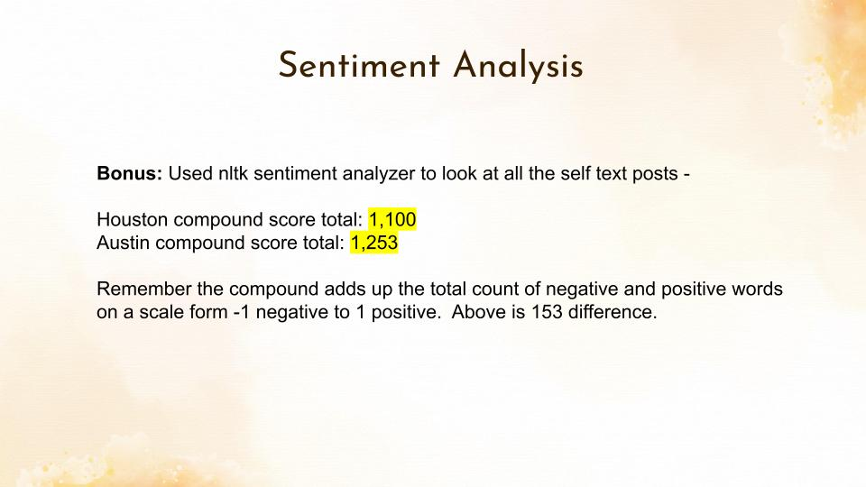

# Project 3, Comparing Two City Subreddits (Houston and Austin)

## Problem Statement

Building a classification model to determine which city a reddit post should go in can have many uses.  City officials, election candidates can look at what people are enjoying, or complaining about and are policies working.  An example might be if you approved spending on upgrading your park system are people using and enjoying it.  

In this project we will look at posts from both subreddits Austin and Houston and using Logistic Regression and Random Forest classification models to determine which city a post text should go in.  Success will be determined on the accuracy of the model.

## Executive Summary

What is the best way to evaluate if a city project was a good use of funds?  Cities pass spending proposals all the time but are people really benefiting and using services being spent on.  Of course you have the standard spending for infrastructure like roads and utilities but what about the additional projects like parks?  What is the sentiment of the population?  Is what the people are talking about on social media in line with the city budgeting project goals?

There should be additional metric’s for seeing if these spending proposals are a good use of funds besides just a volume count of visitors.  What do people really find interesting or what are they continuously talking about on social media?  Are their concerns being addressed? 

I built a classification model that classifies subreddit text between two cities Austin and Houston.  Austin is known for its outdoorsy vibe and Houston has spent 100’s of millions to upgrade its city park system.  Has that spending been worth it?  Although reddit posters might not represent a true diversified sample of the population it is a sample of the population.

The model built had very high accuracy (99%).  Meaning that people on the Houston subreddit and people on the Austin subreddit had very different discussions.  I tested it with two models, Logistic Regression and Random Forest.  I also tested numerous parameters for the classification models as well as dug deeply into the evaluation exploring why the accuracy was so high.  Although there were more differences than I expected, I discovered that Austin talks about parks in the top 15 most used words, while parks didn’t even appear in the top 50 in Houston subreddit.  

I thought this would be a little more challenging classification project since the two cities are in the same state, both large, and only 2.5 hours apart(150 miles).  However it appears that at least the people posting on reddit are very different and have different questions, concerns, and interests.

## Data Description

#pulled data from the Reddit API
url = 'https://api.pushshift.io/reddit/search/submission'

Since you can only pull 100 posts at a time, I wrote a funcion where you can pass along the number of times to run and the function will pause for 10 seconds between runs and append the new run data to the bottom of the dataframe and output the dataframe when finished.

The output from the pull above was a json file.  This file contained:

| Column Name | Description           |
|-------------|-----------------------|
| Subreddit   | Name of Subreddit     |
| Title       | Title of Post         |
| Selftext    | Content of Post       |
| Utc         | Time post was created |

Rows that were missing data in the selftext column were removed.  These were assumed to be pictures or videos or other non text related posts.  Also posts that had "[removed]" were deleted as they also had no content in the selftext.

The dataframe for each city was then written to a csv file for the next step.

## Data Cleaning/EDA

Summary of Process:

- Pulled12,100 post from Austin and was able to keep 6,052
- Pulled 15,100 post from Houston and was able to keep 6,044

- Dropped rows that had embedded http web links

- Removed [\n, &amp;x200b, and apostrophes]

- Final Count: 5,441 houston and 5,565 Austin posts

- Added the city names to the list of stop words.

Upon reading in the data I added a column for word count and explored a distribution of how many words were used in posts.

Next I used the default countvectorizer to get a quick look at the top words being counted.  Here I was looking for key words that would give away the classification of the city such as a sports team name or landmark

You can see I'll need to take the city name out and other stop words.  It was run again this time removing stop words and the city names

Now we see "ve" and "x200b"
"ve" is from the apostrophe being removed and x200b is a zero-width space character from the HTML conversion.
I used string replace to remove these text so I could still preserve the rest of the post.

We can see we have mostly unique words with a few overlap

Above: Here I was looking at the top words in each subreddit.  I was hoping to find key words like city landmarks or sports teams that I would need to remove to make the model more fair.  However after looking the seems to be plain unbiased words.

## Model Performance

Ran Logistic and Random Forest Model with Countvectorizer and TFIDF.
Resulting in very high accuracy 99% for both the train and the test

Used pipeline and gridsearch to try different parameters

These are the feature importance.  They are what the model thinks are the most important words to split on deciding to classify the text post

The last step was to look at a confusion matrix and investigate why the model missed classified some text

## Primary Findings

12 not classified correctly:

2 (false Positive) guessed Austin and they were Houston

10 (false negative)guessed Houston that were Austin

#### Investigate the missed posts

Guessed Austin and was Houston:

Have been trying my luck at freshwater fishing the past few weeks and have come up empty. I’ve been toe Dwight D park, Buffalo Run, and Tom Bass. Are there any other places to catch largemouth bass?

Guessed Houston and was Austin:

I’m aware of the spots around Festival Beach but I live in south Austin and would love to avoid crossing the bridge if possible. Thanks for ideas!

I noticed yesterday that the city put some speed bumps on the road into Roy G (Grove St). They start just after the bus turnaround, and they are **no joke**. Quite jarring at 20mph, slow down to 5mph.I guess Im as guilty as anyone else for speeding on that road, but it seems to me that the bumps are not a great addition. Have there been collisions there causing problems, or is it just concerned citizens boofing us?

Just moved out here and want to start exploring. I used to traditional camp back in the NC mountains but obviously it’s so hot here it isn’t the same. Are there any cool spots I could go and park the car and hike during the day then camp in the car?

## Conclusion

Overall:
With high accuracy and low false positives and false negatives I think I have a good model for predicting what someone might post about in one city or another.

An Example of use:
Reddit user posts might not be a true representation of the overall population, however an example of spending and sentiment -  Houston has spent 200 million on upgrading one of it’s largest parks (Memorial park), and allocated an additional 155 million toward upgrading parks around the city yet “park” doesn’t show up in the top 50 words used for the city.

## Next Steps

- Another use can be for an individual to see how similar or different their current city is to a potential new location to live.
   - Vibe, or interests

- Look into if any information available on Reddit users base that might indicate a speech pattern.

- Look into other steps to get the false positives and false negatives to zero.

## Sentiment Analysis

I was looking for more insight into why the model was so accurate.  I ran a sentiment analysis to see if one city was more positive or negative.  They look pretty balanced.
